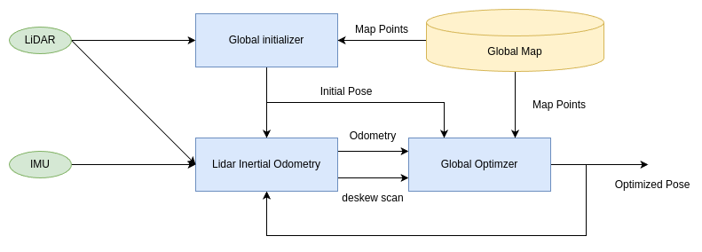

# LiDAR-Inertial-Odometry and Map-Matching Localization

This repository provides a package for localization in environments where the map may change or be incomplete.  
It integrates global map matching using a prebuilt map and motion estimation via LiDAR Inertial Odometry, which does not require a prebuilt map, using Factor Graph Optimization.

## Architect

<div align="center">

</div>

## Install

### 1. Build Dependence

Please clone and build gtsam.

```bash
git clone https://github.com/borglab/gtsam.git
cd gtsam && git checkout 4.2a9
mkdir build && cd build
cmake .. -DGTSAM_BUILD_EXAMPLES_ALWAYS=OFF \
         -DGTSAM_BUILD_TESTS=OFF \
         -DGTSAM_WITH_TBB=OFF \
         -DGTSAM_USE_SYSTEM_EIGEN=ON \
         -DGTSAM_BUILD_WITH_MARCH_NATIVE=OFF
make
sudo make install
sudo ldconfig
```

### 2. Build lioamm_localizer

```bash
mkdir ~/ws/src && cd ~/ws/src
git clone git@github.com:tier4/lioamm_localizer.git
cd ../
rosdep install -y --from-paths . --ignore-src --rosdistro $ROS_DISTRO
colcon build --symlink-install --cmake-args -DCMAKE_BUILD_TYPE=Release
```

## How to launch lioamm_localizer

```bash
ros2 launch lioamm_localizer lioamm_localizer.launch.xml map_path:=<MAP PCD PATH>
```
Set the initialpose topic from Rviz to estimate initial pose.  
Once the initial pose estimation is complete, play the rosbag to start estimation.

If you want to run LiDAR Inertial Odometry alone, follow the steps below.  

```bash
ros2 launch lidar_inertial_odometry lidar_inertial_odometry.launch.xml
```

<div align="center">

</div>

<div align="center">
       
